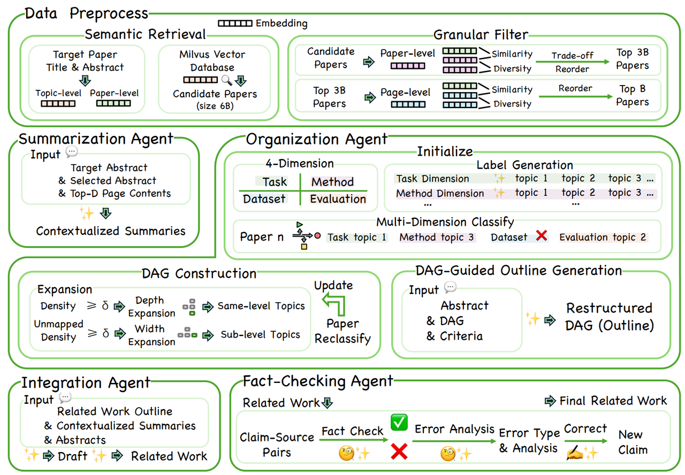

The core implementation of the Multi-Agent Collaborative Generation (MACG) framework for generating high-quality related work sections with citation verification and correction capabilities.

 Environment Setup for MACG Framework

## 🐍 Python Environment Setup

```bash
# Create conda environment
conda create -n MACG python=3.10 -y
conda activate MACG

# Install dependencies
pip install -r requirements.txt
```

## 📦 Core Dependencies

## 🔧 Environment Variables

Create a `.env` file in the project root:

```bash
# LLM API Keys
OPENAI_API_KEY=your_openai_key
OPENROUTER_API_KEY=your_google_key
DEEPSEEK_API_KEY=your_deepseek_key

# Vector Database
MILVUS_URI=http://49.12.219.90:19530
MILVUS_TOKEN=citegeist:citegeist

```

## 🚀 Quick Start

1. **Activate Environment**
   ```bash
   conda activate taxo
   ```

2. **Basic Usage**
```python
from citegeist.generator import Generator
import os
import json,jsonlines
import time
from citegeist.utils.infer import load_processed_ids

generator = Generator(
   llm_provider="gemini",  # Choice of: "azure" (OpenAI Studio), "anthropic", "gemini", "mistral", and "openai"
   api_key=os.environ.get("OPENROUTER_API_KEY"), # Here, you will need to set the respective API key
   model_name="google/gemini-2.5-flash", # Choose the model that the provider supports
   database_uri=os.environ.get("MILVUS_URI", ""),  # Set the path (local) / url (remote) for the Milvus DB connection
   database_token=os.environ.get("MILVUS_TOKEN", ""),  # Optionally, also set the access token (you DON'T need to set this when using the locally hosted Milvus Database)
)

abstract = '''Efficient 3D-Aware Facial Image Editing via Attribute-Specific Prompt Learning: Drawing upon StyleGAN's expressivity and disentangled latent space, existing 2D approaches employ textual prompting to edit facial images with different attributes. In contrast, 3D-aware approaches that generate faces at different target poses require attribute-specific classifiers, learning separate model weights for each attribute, and are not scalable for novel attributes. In this work, we propose an efficient, plug-and-play, 3D-aware face editing framework based on attribute-specific prompt learning, enabling the generation of facial images with controllable attributes across various target poses. To this end, we introduce a text-driven learnable style token-based latent attribute editor (LAE). The LAE harnesses a pre-trained vision-language model to find text-guided attribute-specific editing direction in the latent space of any pre-trained 3D-aware GAN. It utilizes learnable style tokens and style mappers to learn and transform this editing direction to 3D latent space. To train LAE with multiple attributes, we use directional contrastive loss and style token loss. Furthermore, to ensure view consistency and identity preservation across different poses and attributes, we employ several 3D-aware identities and pose preservation losses. Our experiments show that our proposed framework generates high-quality images with 3D awareness and view consistency while maintaining attribute-specific features. We demonstrate the effectiveness of our method on different facial attributes, including hair color and style, expression, and others.''''
result = generator.generate_related_work_MACG(abstract, 10, 2, 0.0)
```


### Core Components

#### `citegeist/` - Main Framework
- **`generator.py`** - Core generator class with citation validation and correction
- **`utils/`** - Utility functions and helper modules
- **`database/`** - Database interaction modules
- **`__init__.py`** - Package initialization

#### `baselines/` - Baseline Implementations
- **`baseline_perplexity_deep_research.py`** - Perplexity Deep Research baseline
- **`baseline_naive_rag_gpt.py`** - Naive RAG with GPT baseline
- **`baseline_vallina_gpt.py`** - Vanilla GPT baseline

#### `multi_dims/` - Multi-dimensional Analysis
- Multi-dimensional literature analysis and visualization tools


## 🚀 Key Features

### 1. Citation Verification & Correction
- **Dual-model validation** using Gemini and DeepSeek
- **Error classification** into 5 categories:
  - Direct Contradiction
  - Information Not Present / Unsubstantiated
  - Misrepresentation / Imprecise Wording
  - Incorrect Attribution
  - Other

### 2. Multi-Agent Framework
- **Summarizer Agent** - Generates concise literature summaries
- **Structurer Agent** - Identifies and groups research themes
- **Integrator Agent** - Synthesizes outputs into coherent narrative
- **FactCheck Agent** - Verifies fidelity to source material

### 3. Evaluation Metrics
- **Claim Precision** - Accuracy of individual claims
- **Citation Precision** - Accuracy of citations
- **Reference Precision** - Accuracy of source attribution
- **Citation Density** - Citation frequency per sentence
- **Average Citations per Sentence** - Citation distribution


---
"# MACG_Multi_Agents_for_Citation_Verification" 
