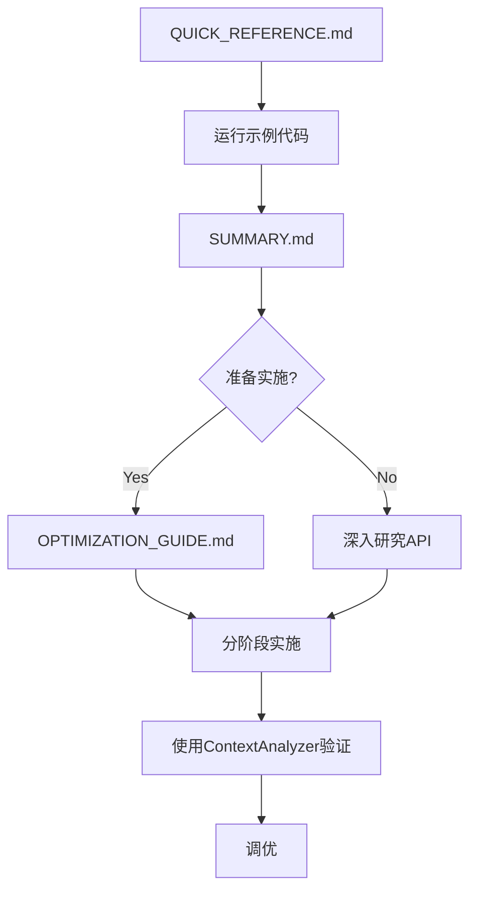

# Agent通信优化 - 文件索引

## 📂 文件结构

```
citegeist/
├── agent_context.py                          # 核心上下文对象
├── utils/
│   ├── prompts_enhanced.py                   # 增强版prompt生成
│   └── context_analyzer.py                   # 分析工具
├── examples/
│   └── optimized_workflow_example.py         # 可运行示例
├── QUICK_REFERENCE.md                        # 快速参考 ⭐ 从这里开始
├── AGENT_COMMUNICATION_OPTIMIZATION_SUMMARY.md  # 总体说明
├── OPTIMIZATION_GUIDE.md                     # 完整实施指南
└── OPTIMIZATION_INDEX.md                     # 本文件
```

---

## 🚀 快速导航

### 我想... 

#### 📖 **了解问题和解决方案**
→ 阅读 [`AGENT_COMMUNICATION_OPTIMIZATION_SUMMARY.md`](AGENT_COMMUNICATION_OPTIMIZATION_SUMMARY.md)

#### ⚡ **快速上手**
→ 阅读 [`QUICK_REFERENCE.md`](QUICK_REFERENCE.md) (3分钟速览)

#### 💻 **看示例代码**
→ 运行 [`examples/optimized_workflow_example.py`](examples/optimized_workflow_example.py)

#### 🔧 **开始实施**
→ 跟随 [`OPTIMIZATION_GUIDE.md`](OPTIMIZATION_GUIDE.md) 分步指南

#### 📊 **分析优化效果**
→ 使用 [`utils/context_analyzer.py`](utils/context_analyzer.py)

#### 🔍 **查看API文档**
→ 阅读各模块的docstrings:
- [`agent_context.py`](agent_context.py)
- [`utils/prompts_enhanced.py`](utils/prompts_enhanced.py)

---

## 📋 文件详情

### 1. 核心模块

#### [`agent_context.py`](agent_context.py) (348行)
**用途**: 定义共享上下文对象

**关键类**:
- `AgentCommunicationContext` - 主上下文类
- `PaperContext` - 论文完整信息(含full_text_segments)
- `DAGContext` - DAG结构信息
- `CitationContext` - 引用验证信息

**何时使用**: 
- 在`generator.py`中初始化工作流时
- 需要在agents间传递信息时

**示例**:
```python
from citegeist.agent_context import AgentCommunicationContext
context = AgentCommunicationContext(...)
```

---

### 2. 增强工具

#### [`utils/prompts_enhanced.py`](utils/prompts_enhanced.py) (186行)
**用途**: 生成包含完整上下文的prompts

**关键函数**:
- `generate_enhanced_feedback_prompt()` - 增强版feedback
- `generate_enhanced_revision_prompt()` - 增强版revision
- `generate_enhanced_validation_prompt_with_full_text()` - 用完整文本验证

**何时使用**:
- 替换原有的prompt生成函数
- 需要利用完整上下文时

**示例**:
```python
from citegeist.utils.prompts_enhanced import generate_enhanced_feedback_prompt
prompt = generate_enhanced_feedback_prompt(
    related_work=...,
    source_abstract=...,  # 新增
    dag_context=...,      # 新增
    papers=...,           # 含full_text
    citations=...
)
```

---

#### [`utils/context_analyzer.py`](utils/context_analyzer.py) (367行)
**用途**: 分析信息流动和优化效果

**关键类/函数**:
- `ContextAnalyzer.analyze_information_flow()` - 分析信息流动
- `ContextAnalyzer.compare_workflows()` - 对比优化前后
- `ContextAnalyzer.generate_report()` - 生成分析报告

**何时使用**:
- 调试信息损失问题时
- 评估优化效果时
- 生成分析报告时

**示例**:
```python
from citegeist.utils.context_analyzer import ContextAnalyzer
report = ContextAnalyzer.generate_report(context.agent_history)
print(report)
```

---

### 3. 示例和文档

#### [`examples/optimized_workflow_example.py`](examples/optimized_workflow_example.py) (400+行)
**用途**: 完整的可运行示例

**内容**:
- 初始化上下文
- 保存完整论文信息
- DAG构建和结构保存
- 使用增强版prompts
- 分析和保存结果

**如何运行**:
```bash
python citegeist/examples/optimized_workflow_example.py
```

**预期输出**:
- 展示完整工作流
- 对比优化前后
- 显示信息保留情况

---

#### [`QUICK_REFERENCE.md`](QUICK_REFERENCE.md) ⭐ **推荐先看这个**
**用途**: 快速参考卡片

**内容**:
- 问题诊断
- 3步解决方案
- 常用代码片段
- 对比表格
- FAQ

**适合**: 
- 快速了解优化方案
- 查找常用代码
- 解决常见问题

---

#### [`AGENT_COMMUNICATION_OPTIMIZATION_SUMMARY.md`](AGENT_COMMUNICATION_OPTIMIZATION_SUMMARY.md)
**用途**: 总体说明文档

**内容**:
- 核心问题分析
- 解决方案概述
- 提供文件清单
- 快速开始指南
- 预期效果
- 注意事项

**适合**:
- 了解整体方案
- 规划实施步骤
- 评估成本收益

---

#### [`OPTIMIZATION_GUIDE.md`](OPTIMIZATION_GUIDE.md) (400+行)
**用途**: 完整实施指南

**内容**:
- 详细问题诊断
- 分步实施教程
- 代码示例(带注释)
- 优化前后对比
- 实施建议和时间表
- 注意事项

**适合**:
- 实际修改代码时参考
- 深入理解优化原理
- 分阶段实施

---

## 🎯 使用流程建议

### 第一次接触 (30分钟)
1. ✅ 阅读 `QUICK_REFERENCE.md` (5分钟)
2. ✅ 运行 `examples/optimized_workflow_example.py` (5分钟)
3. ✅ 阅读 `AGENT_COMMUNICATION_OPTIMIZATION_SUMMARY.md` (20分钟)

### 准备实施 (2小时)
1. ✅ 详细阅读 `OPTIMIZATION_GUIDE.md`
2. ✅ 研究 `agent_context.py` 的API
3. ✅ 查看 `prompts_enhanced.py` 的实现
4. ✅ 规划实施步骤和时间

### 实施中 (3-5天)
1. ✅ 按 `OPTIMIZATION_GUIDE.md` 分阶段实施
2. ✅ 参考 `QUICK_REFERENCE.md` 查找代码片段
3. ✅ 遇到问题查看示例代码
4. ✅ 使用 `context_analyzer.py` 调试

### 验证效果 (1天)
1. ✅ 使用 `ContextAnalyzer.compare_workflows()` 对比
2. ✅ 生成分析报告
3. ✅ 根据报告调优

---

## 📈 学习路径



---

## 💡 Tips

1. **从示例开始**: 先运行示例代码,看到实际效果
2. **渐进式实施**: 不要一次改太多,分阶段实施
3. **保留原接口**: 实施时保持向后兼容
4. **记录对比**: 使用ContextAnalyzer记录优化前后对比
5. **控制Token**: 如果token超限,适当截断long文本

---

## 🆘 获取帮助

### 查找特定内容

| 我想找... | 去哪里 |
|----------|--------|
| 快速上手 | `QUICK_REFERENCE.md` |
| 代码示例 | `examples/optimized_workflow_example.py` |
| API文档 | 各模块的docstrings |
| 实施步骤 | `OPTIMIZATION_GUIDE.md` |
| 分析工具 | `utils/context_analyzer.py` |
| 问题诊断 | `AGENT_COMMUNICATION_OPTIMIZATION_SUMMARY.md` |

### 常见问题

**Q: 我应该先看哪个文件?**  
A: `QUICK_REFERENCE.md` → 运行示例 → `SUMMARY.md`

**Q: 代码太多看不懂怎么办?**  
A: 先运行`optimized_workflow_example.py`,看输出理解流程

**Q: 如何验证我的修改是否正确?**  
A: 使用`ContextAnalyzer.generate_report()`分析信息流动

**Q: Token超限怎么办?**  
A: 参考`OPTIMIZATION_GUIDE.md`的"Token限制"部分

---

## 📞 支持

1. 查看相关文档的FAQ部分
2. 检查示例代码的注释
3. 使用`ContextAnalyzer`分析问题
4. 查看`agent_history`追踪执行流程

---

**最后更新**: 2025-09-30  
**版本**: 1.0


